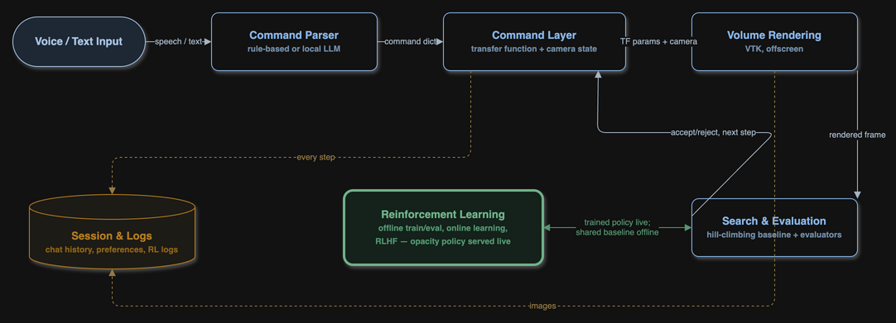

# Voice-Driven Transfer-Function Design

Speech-controlled volume rendering for CT and MRI data. A user describes a
visual goal, the command parser changes the transfer function, and the result
is rendered immediately. The project compares rule-based search, RL policies,
and a goal-conditioned reward model trained from human preferences.

<p align="center">
  
</p>

Detailed architecture and mathematical notes:

- `docs/architecture.typ` and `docs/architecture.pdf`
- `docs/rl-write-test.typ` and `docs/rl-math.pdf`

## Setup

Use a virtual environment. Install dependencies with the same Python that will
run the project:

```bash
python3 -m venv .venv
source .venv/bin/activate
python -m pip install --upgrade pip
python -m pip install -r requirements.txt
```

First Whisper use downloads and caches a model. LLM parsing requires Ollama:

```bash
ollama serve
ollama pull qwen2.5:7b
```

Without Ollama, `--parser llm` falls back to the rule parser.

## Quick Start

```bash
python mvp.py
python mvp.py --cmd "increase opacity for bone strongly"
python mvp.py --cmd "show only bone" --learn --steps 15
python mvp.py --listen
python server.py
```

The web UI runs at `http://127.0.0.1:8000`. Start commands from repository
root because the application uses relative paths such as `out/` and `static/`.

The current transfer-function state persists in `out/state.json`. Delete that
file or run `reset` to return to the default state.

## Commands

```text
increase|decrease opacity for <tissue> [slightly|moderately|strongly]
show only <tissue> [and <tissue> ...]
<low|medium|high> opacity for <tissue>
sharpen|soften <tissue>
brighten|darken <tissue>
shift <tissue>'s center up|down
rotate left|right | tilt up|down | zoom in|out
reset
```

Supported tissues: `bone`, `spongy`, `soft`, `fat`, and `air`. See
`commands.py` for synonyms and the complete grammar. Camera commands change
the view and do not change the transfer function.

Useful evaluation commands:

```bash
python eval_parsers.py
python eval_parsers.py --llm-model qwen2.5:7b
```

## Data And UI

Default dataset is `mri_head`. Other datasets include `ct_chest`, `ct_skull`,
`ct_cardio`, `ct_abdomen`, and `synthetic`.

```bash
python mvp.py --dataset ct_chest --cmd "show only bone"
python server.py --dataset ct_chest
```

Datasets are downloaded into `data/` and cached. MRI intensities are rescaled
to the transfer-function range, so tissue names are functional labels rather
than guaranteed radiological labels. Use CT data for radiological claims.

The web UI supports:

- Text and voice commands
- Back/forward navigation through session history
- Human Better/Worse judgments during search
- Camera state stored with each history step

VR and web clients can use the same reward-data contract described below.

## Reinforcement Learning

The project has three related RL experiments.

### Objective RL

`rl/env.py` trains an opacity policy. Each episode has a target tissue and a
direction. The policy changes the target peak and receives signed
`mass_fraction` improvement.

```bash
python -m rl.train --timesteps 200000
python -m rl.eval
```

`rl/camera_env.py` trains a separate camera policy against a centroid-alignment
objective:

```bash
python -m rl.camera_train --timesteps 200000
python -m rl.camera_eval
```

`rl/online_train.py` trains the opacity policy continuously and evaluates it
against fixed held-out episodes:

```bash
python -m rl.online_train --timesteps 50000 --eval-interval 5000
python -m plots.online_eval_curve
```

`mass_fraction` is useful for optimization, but it only measures whether a
transfer-function change follows the literal command. It does not measure
whether the rendered image is useful to the user.

### Goal-Conditioned Reward Model

This project now treats reward learning as a goal-conditioned preference
problem:

> Does conditioning reward on the user's tissue and direction improve
> preference prediction and policy behavior beyond a hand-designed objective?

The reward model sees this 18-value observation:

```text
[features_after(4), features_before(4), after-before(4), target_onehot(5), direction(1)]
```

Image features are `mean`, `std`, `coverage`, and `entropy`. Target order is
`air`, `fat`, `soft`, `spongy`, `bone`. The model is an `18 -> 64 -> 32 -> 1`
MLP trained with weighted Bradley-Terry loss. Reward mapping is:

```text
r_model = 2 * sigmoid(R(z)) - 1
```

Training uses scalar image features, not pixels. PNG/JPEG files are retained
for audit, blind evaluation, and recovery of missing legacy features. This
keeps the same data contract usable by web and VR clients without requiring a
vision model.

#### Preference data

Canonical clients write one JSON object per line:

```json
{
  "observation_a": {"before_features": {}, "after_features": {}, "before_image": null, "after_image": null},
  "observation_b": {"before_features": {}, "after_features": {}, "before_image": null, "after_image": null},
  "command": {"attribute": "opacity", "target": "bone", "direction": "increase"},
  "target_tissue": "bone",
  "direction": "increase",
  "label": 1,
  "source": "branch",
  "weight": 1.0
}
```

`label=1` means A is preferred. `label=-1` means B is preferred. Pair sources
have different weights:

- Branch choices: `1.0`, strongest signal
- Accepted/ended episode states: `0.7`
- Absolute thumbs up/down: `0.4`, weakest signal

Branches are extracted only when logs preserve explicit parent/child and
carried-forward metadata. The extractor never guesses branches from similar
parameters.

#### Train and evaluate

Run from repository root:

```bash
python -m rl.extract_pairs \
  --log out/log.jsonl \
  --feedback out/feedback.jsonl \
  --preferences out/rlhf_preferences.jsonl \
  --out out/pairs.jsonl
```

The command prints counts by source, target, and total. Historical logs may
report zero branch pairs because old sessions did not preserve branch metadata.

Pretrain on synthetic rendered pairs. Use a small run first:

```bash
python -m rl.pretrain_reward \
  --pairs 20 --members 1 --epochs 2 \
  --out out/rl_models/reward_pretrained_smoke.pt
```

Full pretraining:

```bash
python -m rl.pretrain_reward \
  --pairs 20000 --members 5 \
  --out out/rl_models/reward_pretrained.pt
```

Synthetic labels currently use signed `mass_fraction`. This is a cold-start
objective, not a human label. The implementation marks the location where a
visibility metric should replace it.

Fine-tune on real preference pairs:

```bash
python -m rl.finetune_reward \
  --preferences out/pairs.jsonl \
  --pretrained out/rl_models/reward_pretrained.pt \
  --out out/rl_models/reward_finetuned.pt
```

Pretrained and fine-tuned artifacts remain separate. Fine-tuning uses a fixed,
seeded held-out split and never trains on evaluation rows.

Evaluate both models on the same test split:

```bash
python -m rl.eval_reward \
  --preferences out/pairs.jsonl \
  --pretrained out/rl_models/reward_pretrained.pt \
  --finetuned out/rl_models/reward_finetuned.pt \
  --disagreements out/reward_disagreements.jsonl \
  --out out/reward_report.json
```

Evaluation reports:

1. Pretrained and fine-tuned accuracy, overall and by pair source
2. RLHF policy performance against the objective metric
3. Blind policy versus hill-climber judgments in a separate results file

The disagreement file identifies cases where the objective and human verdict
disagree, including image paths. These cases show where the objective metric is
blind.

#### Reward safeguards

`RewardModelTFEnv` combines model and objective rewards:

```text
r = alpha * (mean(model_reward) - std(model_reward))
    + (1 - alpha) * objective_reward
```

Default `alpha` is `0.7`. The useful ablations are:

- `alpha=0.0`: objective only
- `alpha=0.7`: blended reward
- `alpha=1.0`: learned reward only

Near-black and near-opaque states receive independent hard penalties. The
ensemble standard deviation discourages states outside the training
distribution.

## Tests

```bash
python -m pytest -q -m "not slow"
python -m pytest -q
```

Reward pipeline tests:

```bash
python -m pytest -q \
  tests/test_rl_reward_model.py \
  tests/test_rl_reward_model_env.py \
  tests/test_rl_extract_pairs.py \
  tests/test_rl_reward_pipeline.py
```

## Project Layout

- Root files: rendering, transfer functions, parser, CLI, and web UI
- `rl/`: environments, policies, reward model, data pipeline, evaluation
- `data/`: datasets and parser evaluation phrases
- `out/`: runtime state, logs, images, models, and reports
- `tests/`: automated tests
