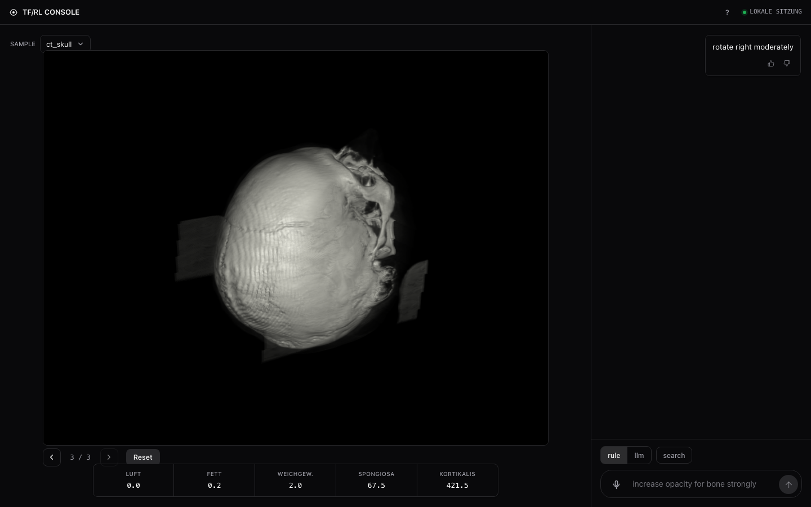

# Say what you want to see

**Speak to a CT scan and watch it reveal what you asked for.** "Show only the
skeleton." "More lungs, a bit less soft tissue." A rule engine or a local LLM
parses the words, and the transfer function — the map from tissue density to
colour and opacity — is rewritten so the render answers.

<p align="center">
  
</p>

> The screenshot above predates the RL v2 vocabulary — it still shows the
> retired `LUFT / FETT / SPONGIOSA / KORTIKALIS` intensity bands. The live
> readout is the four goal classes the policy is scored on.

The research question underneath: **can that transfer function be learned?** Not
hand-tuned per scan, not hill-climbed for a hundred seconds per command, but
produced by a policy that has seen enough patients to know what "show the ribs"
requires on *this* one — and eventually trained on what a radiologist actually
prefers, rather than on a formula someone invented.

This repository is a master's thesis in progress. It contains a working voice
UI, a measurement of what a rendering actually shows that is validated against
real renders, a learned policy that follows instructions on patients it has never
seen, and the apparatus for learning from human preferences.

---

## See the claim, don't take it on trust

Type an instruction and press **compare**. The same instruction is answered four
ways from the same starting point — applied directly, hill-climbed at 10
evaluations and at 200, and by the policy — with each answer's render, its
attainment, and what it cost side by side.

<p align="center">
  
</p>

On `ts_s0477`, a patient the policy has never seen, from the default transfer
function:

| instruction | exact | search · 10 | search · 200 | **policy** |
|---|---|---|---|---|
| more bone | −0.001 | +0.348 | +0.582 | **+0.541** |
| brighten the skeleton | +0.025 | +0.000 | +0.941 | **+0.775** |

Read the cost column, not the clock: exact and the policy spend **zero**
visibility evaluations, cheap search spends ten, thorough search two hundred. On
"more bone" the policy beats both searches outright. On brightness, ten
evaluations of hill-climbing achieve *nothing* — it has not yet reached the
colour dimensions — while the policy lands it for free.

One comparison is a single episode, and the thesis's claim is a median. So
press **sweep 20**: twenty instructions sampled from the same grammar, and what
each method does across all of them.

<p align="center">
  
</p>

| sweep seed | exact | search · 10 | **policy** |
|---|---|---|---|
| 0 | −0.209 (37 %) | +0.342 (100 %) | **+0.473 (90 %)** |
| 1 | −0.263 (22 %) | +0.387 (100 %) | **+0.443 (95 %)** |
| 2 | +0.041 (60 %) | +0.384 (100 %) | **+0.352 (90 %)** |

Five seconds, deterministic in its seed. The search arms call
`rl.baselines.hill_climb` at the budgets the held-out table reports, and
attainment is `goals.attainment` — the panel computes the same quantities as
the thesis, so a demo cannot quietly disagree with it.

Both panels start from wherever the session is. Press **Reset** first if you
want numbers measured from the default transfer function.

---

## The hard part isn't the rendering

A transfer function decides what a volume rendering shows. Get it wrong and the
skin hides the ribs; get it right and the anatomy you asked for stands out. The
difficulty is that "show more bone" has no closed-form answer: it depends on what
lies *in front of* the bone in that particular patient.

The previous version of this project optimised a metric called `mass_fraction` —
the area under the opacity curve over bone's Hounsfield range. It looked
reasonable and was quietly meaningless:

| Change to the transfer function | Bone actually visible | `mass_fraction` says |
|---|---|---|
| default | 0.3 % | 0.26 |
| raise the bone peak to maximum | 0.3 % | **0.43** ("better") |
| clear the fat and soft-tissue peaks | **4.5 %** | 0.26 ("no change") |

The metric never looked at the scan. It rewarded a change that altered nothing on
screen and ignored the one that made bone nine times more visible. Everything
below follows from fixing that.

## Measuring what a render shows

`visibility.py` estimates, for a given transfer function, how much each
anatomical structure contributes to the final image and how bright it appears. It
resamples each volume once per viewing direction, labels every sample by anatomy
(from TotalSegmentator masks: skeleton, lungs, organs, muscle, vessels), and
composites front to back — **14 ms**, against 50–210 ms for a real render, and it
can attribute pixels to tissues, which a render cannot.

It is validated against VTK by rendering each state twice: once normally, once
with one structure's *colour* blacked out and its opacity untouched. The
difference is exactly that structure's contribution.

| | skeleton | lungs | organs | muscle | vessels | coverage |
|---|---|---|---|---|---|---|
| correlation with real renders | 0.89–0.99 | 0.69–0.97 | 0.94–1.00 | 0.92–0.97 | 0.98–0.99 | 1.00 |

Measured over six volumes. Lungs were previously reported here as unvalidated,
"below the renderer's noise floor". That was wrong, and the cause is worth
stating: the probe that decides how much of a class a transfer function can
reach was built from the retired intensity-band layout, whose first peak sits
at fat (−100 HU) rather than lung parenchyma (−800 HU). Measured through the
correct peak, lungs validate like any other class on five of six volumes
(0.69 on the sixth). See `docs/rl-v2-pipeline.typ` for the caveats that belong
with every number here.

```bash
python -m tools.validate_visibility ts_s1379 ts_s1337 ts_s0454
```

## Learning the mapping

An instruction becomes a target: a requested change in visibility and brightness
per structure. The policy sees the instruction, the scan's intensity histogram,
what is currently visible and what is *achievable* on this scan, and outputs a
transfer function in a single forward pass.

Measured on 200 instructions over six patients it never saw, median over three
training seeds:

| Method | Evaluations used | Median attainment | Improved |
|---|---|---|---|
| hill-climb (thorough) | 200 | +0.692 | 100 % |
| **policy + 3 refinements** | **4** | **+0.371** | 80 % |
| **policy alone** | **0** | **+0.331** | 78 % |
| hill-climb (cheap) | 10 | +0.258 | 93 % |
| do nothing | 0 | 0.000 | — |
| today's rule-based executor | 0 | −0.022 | 37 % |
| random | 0 | −0.040 | 39 % |
| occlusion heuristic | 0 | −0.198 | 30 % |

Attainment is 1 when the instruction is satisfied, 0 when nothing changed,
negative when the result got worse. The policy beats every non-search baseline at
p < 0.001, and with no evaluations at all it matches a hill-climber allowed ten of
them. It is not yet as *reliable* as search (78 % vs 93 % of instructions
improved) — that gap is the honest headline. Per seed the paired comparison
against cheap search: p = 0.607, 0.892, 0.610 — none reach significance, so
"matches" now holds uniformly across all three seeds, not just two of three as
before the reward fix below.

This table was wrong three times, and every correction is worth recording.

The first: an early version reported +0.194 for the policy alone, inflated by a
colour decode that collapsed every peak to grey and by a reachable-ceiling probe
that sat on the retired band layout's fat peak rather than lung parenchyma.

The second was a measurement accident rather than a defect in the system. The
batch that produced the previously published figures (+0.169 for the policy) was
started before the ceiling fix in `62b5720` landed and finished six hours after
it, so every number in it was computed by the code the job had loaded at import
time. Re-measured on the corrected pipeline, the same three checkpoints score
+0.275 median rather than +0.169 — and so do the baselines, which rose in step
(cheap search +0.205 -> +0.263, thorough search +0.660 -> +0.730). That the
baselines moved together is the evidence that the ruler was bent, not the policy.
`provenance.py` now records the git commit and a fingerprint of the imported
scoring code in every result file so this cannot recur silently.

The same accident produced a null result that does not survive correction.
Retraining on the corrected observation was reported as changing nothing
(+0.1732 vs +0.1743, p = 0.85). Re-measured: v2 +0.201 against v3 +0.286
seed-averaged median, paired Wilcoxon **p = 0.0064**, v3 ahead on 59 % of
episodes. The gain concentrates in absolute instructions (+0.122), which are
exactly the ones that read the reachable-ceiling channel — so that channel earns
its place after all, contrary to what
`docs/experiments/2026-09-16-retrain-after-measurement-fixes.md` concluded from
the stale numbers.

The third: `visibility.py` measures five anatomical classes, but every voxel
labelled as none of them — fat, connective tissue, partial-volume edges — was
invisible to the objective entirely. A transfer function could satisfy "show
only bones" by rendering an opaque wall of that unclassified material instead
of bone, and nothing charged for it: driving the viewer's search on "show only
bones" reached full frame coverage while every one of the five labelled
classes read below 0.001 of the image. Fixed by adding an "other" bucket to
`visibility.py` and charging for it in `goals.distance` under the same
keep-tolerance any unmentioned class gets, verified with new unit tests before
retraining. Three fresh seeds, same architecture, same 150k timesteps: policy
alone rose +0.275 → +0.331, policy+refinement +0.316 → +0.371, and thorough
search's own number *dropped* +0.730 → +0.692 (it was exploiting the same gap
via `goals.distance`, now correctly discounted). What the fix did *not* do:
teach the policy to actually solve `show_only` — re-measured with the new
checkpoint, "show only bones" on `ts_s0477` still renders 60% unclassified
material and under 0.2% skeleton, just slightly better-suppressed elsewhere.
Full write-up, including that caveat, in `docs/rl-paper.typ` (`@v4-retrain`)
and `docs/STATUS.md`.

One more, smaller fix the same session: the rule-based "show only" only ever
sets a peak's *height*, never its *width* — skeleton's default width (280 HU)
is wide enough that boosting it still lights up neighbouring tissue whose own
peak is correctly zeroed. "Show only" now also caps the shown peak's width to
150 HU. On the case that exposed it, soft-tissue haze fell 124× (3.98%→0.03%)
for a 12% cost to skeleton's own visibility, turning a clear regression
(−0.448) into a clear win (+0.148) — but it barely moved B1's *aggregate*
200-episode score (−0.022→−0.0225), since which class gets asked for and how
bright it started matters more to that number than this fix does.

```bash
python -m rl.oneshot_train --timesteps 150000 --seed 0 --out out/rl_v2/seed0
python -m rl.vis_eval --policy out/rl_v2/seed0/best.zip --split test --episodes 200 --refine 3
```

## Why a policy at all, when search works?

Because search stops working the moment the objective is a person. A hill-climber
needs 10–200 evaluations per instruction. You cannot ask a radiologist 200 times
whether they like a rendering, and even against a learned preference model each
evaluation costs a render plus an embedding — roughly 100 seconds per spoken
command. A policy answers in one pass.

That is what the collection page is for:

```bash
python server.py      # then open http://127.0.0.1:8000/collect
```

Each item shows an instruction and two candidate results as six views each, with
no hint of where either came from. Press **A**, **B**, **E** (equal) or **S**
(skip). Roughly every tenth item repeats an earlier one with the sides swapped —
that measures your self-consistency, which is the ceiling any reward model can
reach. Judgments land in `out/vis_preferences.jsonl`, ready for reward-model
training.

### A second rater

~2000 judgments from one person is a start; the thesis needs several raters,
including clinical supervisors, and inter-rater agreement to know how much any
of them — or a reward model trained on them — can be trusted. A second rater
does exactly what the first one did: `python server.py`, open `/collect`, judge.
The page now also asks, once, for a role (radiologist/clinician/researcher/
other) and optional experience ("8 years CT"); everything else is unchanged.
When they're done, they send their `out/vis_preferences.jsonl`.

Different raters only agree measurably if they judge *some of the same items* —
so roughly one item in five is drawn from a fixed anchor pool
(`rl.candidates.anchor_items`), the same items in the same order for every
rater, independent of who has judged what before. The rest are sampled fresh,
same as with one rater.

```bash
python -m tools.merge_preferences out/*.jsonl --out out/preferences_merged.jsonl
```

merges every rater's file (de-duplicated on pair + rater, later timestamp wins)
and reports, per pair of raters, how much they agreed on the anchor items they
share — raw agreement and linearly-weighted Cohen's kappa — plus Krippendorff's
alpha across all raters together and each rater's own self-consistency (the
repeats above). Agreement is resolved by *which candidate* a rater chose, never
by which letter it was shown as, since sides are shuffled independently per
rater. Inter-rater agreement is the ceiling any reward model trained on this
data can be expected to reach: it cannot be more consistent with any one rater
than the raters are with each other.

## What did not work

Documented, with the curves, because the failures shaped the design:

- **Ten-step refinement.** Letting the policy nudge parameters over ten steps
  does not train — it stays flat across volumes and *degrades* with more training
  on a single one (−0.15 → −0.98). The diagnosis: the policy must commit to each
  change blind, while the search it is compared against may try a change, measure
  it, and reject it. It was being asked to learn an optimisation procedure.
- **Intensity-band tissue labels.** "Fat" also collects lung edges; "spongy"
  collects contrast-filled vessels. Both failed validation (0.46–0.68) until the
  labels became anatomical.
- **Measuring a tissue by deleting it.** Removing its voxels opens holes that
  reveal what is behind, so the measurement includes the background. Blackening
  the colour while keeping opacity is the correct reference.
- **An unforgiving side-effect penalty.** Punishing any drift in unmentioned
  structures made *doing nothing* beat executing the instruction.

## Using the viewer

```bash
python server.py                      # http://127.0.0.1:8000
python server.py --dataset ct_chest
```

Text or voice (push-to-talk with Space), rule or LLM parsing, history
navigation, and a local `vtk.js` renderer that applies transfer-function and
camera changes in the browser. A third toolbar toggle, **policy**, answers
with the trained one-shot policy instead of applying the command exactly —
it turns the parsed command into a goal vector (`goals.goal_from_command`)
and runs the policy in a single forward pass, falling back to exact
application when there is no trained checkpoint or the command is not a goal
(camera, reset, width, brightness, centre).

**compare** answers the same instruction four ways at once from the same start
state — applied directly, hill-climbed at 10 evaluations (B3) and at 200 (B4),
and by the policy — and reports each arm's attainment, evaluation count, wall
clock and per-class effect beside its render. The search arms call
`rl.baselines.hill_climb` and attainment is `goals.attainment`, so the panel
computes the same quantities as the held-out table rather than a lookalike. It
plots whichever channel the instruction names: "brighten the skeleton" is a
brightness goal and barely moves visibility, so plotting visibility would show
four near-identical bars beside attainments ranging from +0.00 to +0.94.

**sweep 20** runs twenty instructions sampled from the same grammar and reports
each method's median attainment and how often it improved on doing nothing.
One comparison is a single draw; the thesis's claim is a median, and the
reliability gap means roughly one instruction in four has the policy not
improving. Five seconds, deterministic in its seed. Thorough search is left out
of the sweep — 200 evaluations across twenty instructions is about a minute.

Commands name one of four
anatomical classes — `skeleton`, `lungs`, `soft` (organs and muscle
together), `vessels` (contrast scans only):

```text
increase|decrease opacity for <class> [slightly|moderately|strongly]
show only <class> [and <class> ...]
<low|medium|high> opacity for <class>
sharpen|soften <class>   ·   brighten|darken <class>
shift <class>'s center up|down
rotate left|right   ·   tilt up|down   ·   zoom in|out   ·   reset
```

Natural phrasings work too — "more bone", "a bit less soft tissue", "show me
the lungs" — and several relative or absolute clauses in one sentence become
a compound command. LLM parsing needs Ollama (`ollama serve && ollama pull
qwen2.5:7b`); without it, the `llm` toggle falls back to the rule parser. See
`COMMANDS.md` for the full grammar. The UI session persists in
`out/ui_session.json`; say `reset` or delete that file to start over.

## Data

30 CT scans from the TotalSegmentator small subset (CC-BY-4.0), split by subject
into 20 train / 4 validation / 6 test and stratified by body region, plus four
3D Slicer CTs as an out-of-source test set from different scanners. Anatomical
labels come from the dataset's 117 structure masks.

```bash
curl -L -o data/Totalsegmentator_dataset_small_v201.zip \
  "https://zenodo.org/records/10047263/files/Totalsegmentator_dataset_small_v201.zip?download=1"
python -m tools.select_totalseg          # select, label, split (writes the manifest)
python -m tools.build_visibility_cache   # precompute the visibility caches
```

The selection is deterministic and committed as `data/totalseg_manifest.json`, so
the splits reproduce without redistributing the scans. Volumes load in canonical
anatomical orientation; `python -m tools.check_orientation <name>` writes
projection images to verify it.

## Setup

```bash
python3 -m venv .venv && source .venv/bin/activate
python -m pip install --upgrade pip
python -m pip install -r requirements.txt
```

Run everything from the repository root — the code uses relative paths such as
`out/` and `static/`. First Whisper use downloads and caches a model.

## Tests

```bash
python -m pytest -q -m "not slow"    # fast suite
python -m pytest -q                  # everything
```

## Layout

| Path | What lives there |
|---|---|
| `server.py`, `static/` | web UI, voice, local 3D viewer, collection page |
| `commands.py`, `asr.py` | instruction parsing (rule + LLM), speech |
| `transfer.py`, `render.py`, `views.py` | transfer functions, VTK rendering, the six standard views |
| `visibility.py`, `goals.py` | what a render shows; instructions and how they are scored |
| `rl/` | environments, the one-shot policy, baselines, evaluation |
| `datasets.py`, `totalseg.py` | volumes, splits, anatomical labels |
| `tools/` | data selection, cache building, validation, reports |
| `docs/` | design specs, plans, and `rl-v2-pipeline.typ` (the full write-up) |

## Reading further

- `docs/rl-paper.typ` — the whole thing as a paper: problem, method, setup,
  results, the measurement incident, and what the thesis delivers.
- `docs/rl-v2-pipeline.typ` — the working log behind it, including the two
  formulations that failed and the validation detail the paper compresses.
- `docs/superpowers/specs/2026-09-15-rl-v2-visibility-rlhf-design.md` — the
  design this was built from.
- `docs/REPRODUCE.md` — every command from raw data to the held-out table, with
  the real timings and what each stage writes.
- `docs/experiments/` — dated experiment records, predictions written before the
  run, and the addendum recording the stale-measurement incident.

Documents describing the previous pipeline (`docs/architecture.typ`,
`docs/rl-write-test.typ`, `docs/rl-math.pdf`, `architecture-mvp.drawio`) were
removed on 2026-09-18; they described the retired `mass_fraction` vocabulary.
The execution plans and design notes for features that have since shipped —
camera control, the command grammar, the local 3D viewer, and the RL v2 phase
plans — were removed on 2026-09-20. All of it is in git history.
