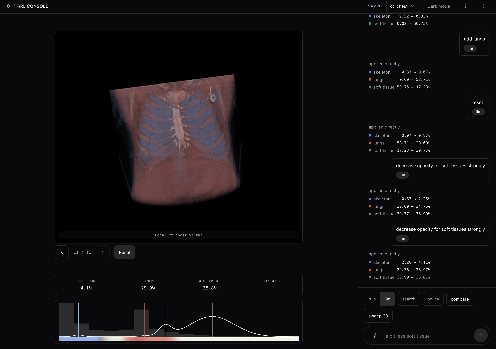
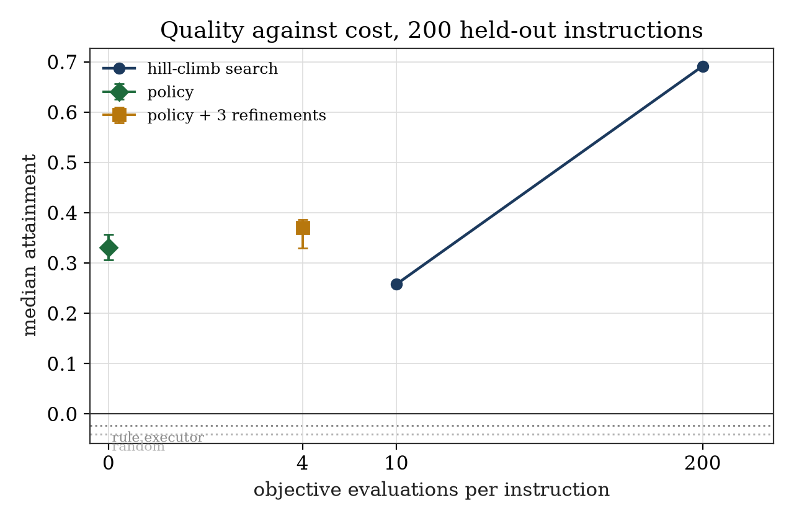
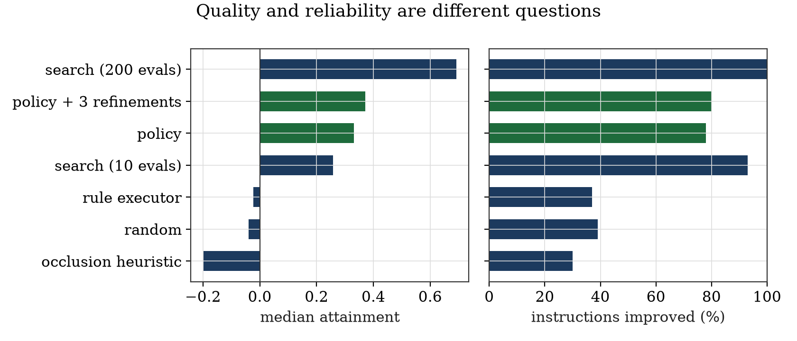
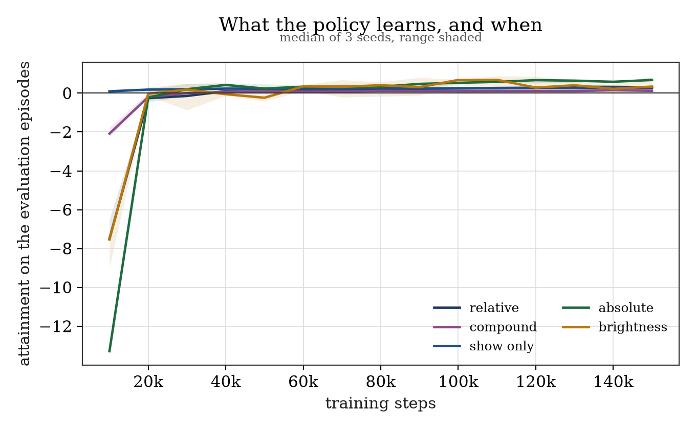

# Say what you want to see

Speak to a CT scan and it renders what you asked for — "show only the
skeleton," "a bit less soft tissue." A rule parser or a local LLM turns the
words into a transfer-function change; a trained policy can also propose the
whole transfer function in one shot instead of hand-tuning it.

<p align="center">
  
</p>

This is a master's thesis: can a transfer function be learned with RL well
enough to follow spoken instructions on a patient it has never seen? So far:
the policy matches a 10-evaluation hill-climb while spending zero.

## Try it

```bash
python server.py      # http://127.0.0.1:8000
```

Type or hold Space to talk. Press **compare** to answer one instruction four
ways from the same start — applied directly, hill-climbed at 10 and 200
evaluations, and by the policy — with attainment and cost side by side.
**sweep 20** does the same across twenty sampled instructions, since one
comparison is a single episode and the thesis's claim is a median.

<!-- TODO screenshot: the compare panel, four columns.
     Save as docs/screenshots/compare-panel.png -->

On `ts_s0477`, a patient the policy never trained on:

| instruction | exact | search·10 | search·200 | policy |
|---|---|---|---|---|
| more bone | −0.001 | +0.348 | +0.582 | **+0.541** |
| brighten the skeleton | +0.025 | +0.000 | +0.941 | **+0.775** |

Exact and policy cost zero visibility evaluations; cheap search costs ten,
thorough costs two hundred.

## Why this is hard

"More bone" has no closed-form answer — it depends what's sitting in front of
the bone on that particular scan. An earlier version of this project scored
transfer functions with a formula that never looked at the render: it called
an invisible change "better" and a 9× visibility gain "no change."
`visibility.py` replaced it with a cheap render-shaped estimate (14 ms
against 50–210 ms for a real render). Historical five-class validation reached
Pearson r 0.89–1.00 across its validated classes; current eight-class support
uses the same validation gate and must be revalidated per volume and class.

## The policy

Given an instruction, the scan's intensity histogram, and what's currently
visible and reachable, the policy outputs a complete transfer function in one
forward pass — no search loop. Held out on 200 instructions across six
unseen patients:

| Method | Evaluations | Median attainment | Improved |
|---|---|---|---|
| hill-climb (thorough) | 200 | +0.692 | 100 % |
| **policy + 3 refinements** | 4 | **+0.371** | 80 % |
| **policy alone** | 0 | **+0.331** | 78 % |
| hill-climb (cheap) | 10 | +0.258 | 93 % |
| do nothing | 0 | 0.000 | — |
| rule executor | 0 | −0.022 | 37 % |
| random | 0 | −0.040 | 39 % |
| occlusion heuristic | 0 | −0.198 | 30 % |

The policy beats every non-search baseline at p < 0.001. It's not yet as
*reliable* as search — 78 % vs 93 % of instructions improved — and that gap
is the honest headline.

<p align="center">
  
  
</p>

Quality against cost, and quality against reliability — the same 200-episode
table, plotted two ways. Regenerate with `plots.held_out_results` once new
result files exist; nothing in these figures recomputes a score, so they
can't disagree with the table above.

This number has moved three times, each time from finding and fixing a real
bug: a colour decode that turned every policy render grey, a stale-code
measurement accident, and — most recently — a reward-hacking blind spot
where a transfer function could satisfy "show only X" by lighting up
unclassified tissue instead of X. Full history in `docs/rl-paper.typ` and
`docs/STATUS.md`, including what each fix did and didn't solve.

<p align="center">
  
</p>

Per instruction kind, median of the three seeds: absolute, brightness and
relative all plateau comfortably positive; compound and show-only plateau
close to zero — the clearest capability gap, and the one a user notices
first.

## Why a policy, not just search

A hill-climb needs 10–200 renders per instruction. You can't ask a person to
rate 200 renders per spoken command. A policy answers in one pass, which is
what makes learning from human preference feasible — that's what `/collect`
is for:

```bash
python server.py      # then open /collect
```

Two candidate renders per instruction, judged blind — A, B, equal, or skip.
Several raters' files merge with `tools.merge_preferences`, which also
reports inter-rater agreement: the ceiling any reward model trained on this
data can reach. Currently 0 clean judgments — the 54 collected before a
rendering bug was fixed are quarantined as a pilot.

## What didn't work

- A ten-step formulation, nudging parameters over ten steps — never learned,
  got worse with more training. It asked the policy to learn a search
  procedure instead of a mapping.
- Intensity-band tissue labels ("fat", "spongy") — needed real anatomy
  labels instead.
- Measuring a tissue's visibility by deleting its voxels — opens a hole that
  reveals what's behind it. Blacking out colour, not opacity, is correct.

## Data

30 CT scans from TotalSegmentator (CC-BY-4.0), split 20/4/6 train/val/test,
plus four Slicer CTs as an out-of-source set.

```bash
curl -L -o data/Totalsegmentator_dataset_small_v201.zip \
  "https://zenodo.org/records/10047263/files/Totalsegmentator_dataset_small_v201.zip?download=1"
python -m tools.select_totalseg
python -m tools.build_visibility_cache
```

## Setup

```bash
python3 -m venv .venv && source .venv/bin/activate
python -m pip install -r requirements.txt
python -m pytest -q -m "not slow"
```

Run from the repository root — paths like `out/` and `static/` are relative.
LLM parsing needs Ollama (`ollama serve && ollama pull qwen2.5:7b`); without
it, commands fall back to the rule parser automatically. Full grammar in
`COMMANDS.md`.

Anatomical commands include heart, vessels/aorta, liver, kidneys, and spleen,
for example `show only heart`, `more aorta`, `brighten liver`, `more kidneys`,
and `show only spleen`. These targets use approximate Hounsfield-unit bands,
not segmentation-driven opacity: overlapping tissues can remain visible, so
"show only" is an approximate isolation request rather than an anatomical
guarantee.

## Layout

| Path | What's there |
|---|---|
| `server.py`, `static/` | web UI, voice, local viewer, preference collection |
| `commands.py`, `asr.py` | instruction parsing, speech |
| `transfer.py`, `render.py`, `views.py` | transfer functions, rendering |
| `visibility.py`, `goals.py` | what a render shows; instructions and scoring |
| `rl/` | environments, the policy, baselines, evaluation |
| `datasets.py`, `totalseg.py` | volumes, splits, anatomical labels |
| `docs/` | the full write-up, status, plans |

## Reading further

- `docs/rl-paper.typ` — the whole thing as a paper.
- `docs/STATUS.md` — current state, dated.
- `docs/REPRODUCE.md` — every command from raw data to the held-out table.
